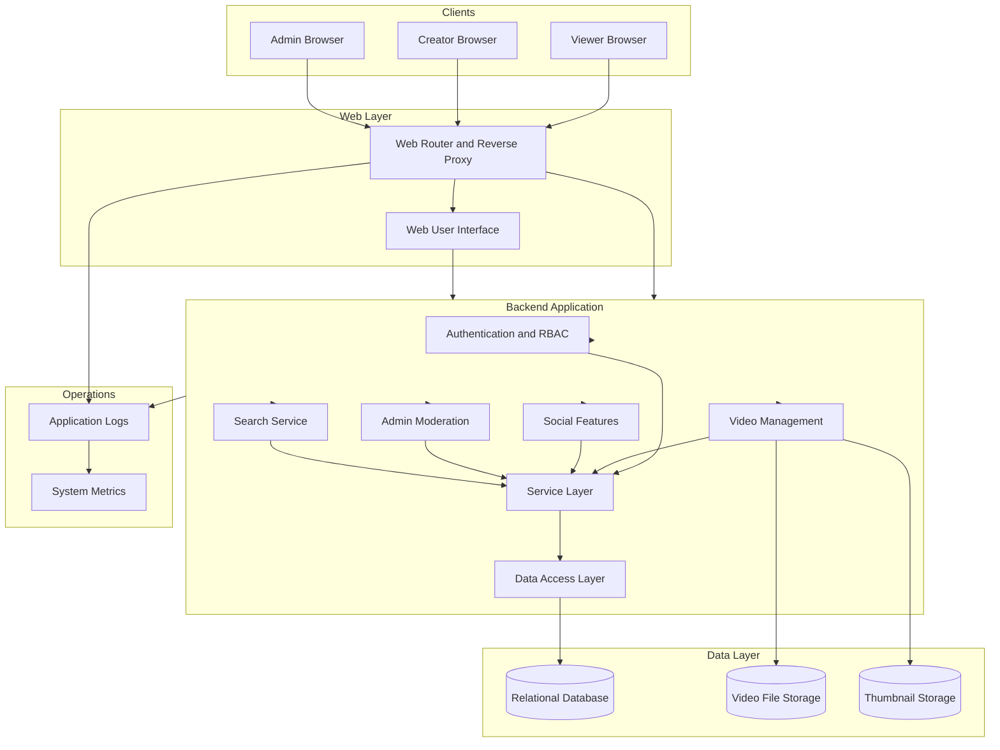

# OOP-Team-B_Youtube-lite
A lightweight YouTube-style application built as an OOP team project.

## System Architecture

## Recomended File Structure
```text
youtube-lite/
├── README.md              # Project overview and setup instructions
├── .gitignore             # Git ignored files
├── .env                   # Environment variable template
├── requirements.txt       # Python dependencies
│
├── src/
│   └── app/
│       ├── __init__.py    # Application factory
│       ├── config.py      # Application configuration
│       ├── extensions.py  # Flask extensions (DB, auth, etc.)
│       │
│       ├── models/        # Database entities
│       │   └── __init__.py
│       │
│       ├── services/      # Business logic layer
│       │   └── __init__.py
│       │
│       ├── routes/        # Controllers / web endpoints
│       │   └── __init__.py
│       │
│       ├── templates/     # HTML templates
│       │   └── base.html
│       │
│       ├── static/        # CSS, JavaScript, images
│       │   └── style.css
│       │
│       └── utils/         # Helper utilities (RBAC, decorators)
│           └── __init__.py
│
├── tests/
│   └── test_smoke.py      # Basic application startup test
│
└── run.py                 # Application entry point
```
