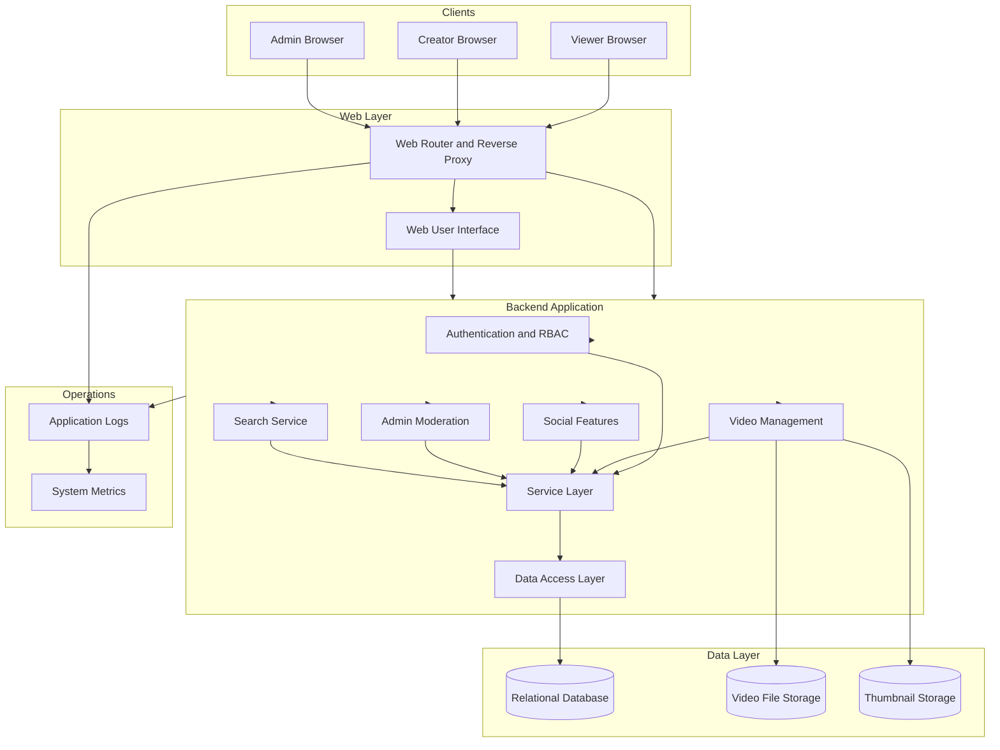

# OOP-Team-B_Youtube-lite
A lightweight YouTube-style application built as an OOP team project.

## System Architecture

```mermaid
flowchart TB

  subgraph C[Clients]
    V[Viewer Browser]
    CR[Creator Browser]
    A[Admin Browser]
  end

  subgraph W[Web Layer]
    R[Web Router and Reverse Proxy]
    UI[Web User Interface]
  end

  subgraph B[Backend Application]
    AUTH[Authentication and RBAC]
    VIDEO[Video Management]
    SOCIAL[Social Features]
    ADMIN[Admin Moderation]
    SEARCH[Search Service]
    SVC[Service Layer]
    DAO[Data Access Layer]
  end

  subgraph D[Data Layer]
    DB[(Relational Database)]
    FS[(Video File Storage)]
    TH[(Thumbnail Storage)]
  end

  subgraph O[Operations]
    LOG[Application Logs]
    MET[System Metrics]
  end

  V --> R
  CR --> R
  A --> R

  R --> UI
  R --> B

  UI --> B

  B --> AUTH
  B --> VIDEO
  B --> SOCIAL
  B --> ADMIN
  B --> SEARCH

  AUTH --> SVC
  VIDEO --> SVC
  SOCIAL --> SVC
  ADMIN --> SVC
  SEARCH --> SVC

  SVC --> DAO
  DAO --> DB

  VIDEO --> FS
  VIDEO --> TH

  B --> LOG
  R --> LOG
  LOG --> MET
```
